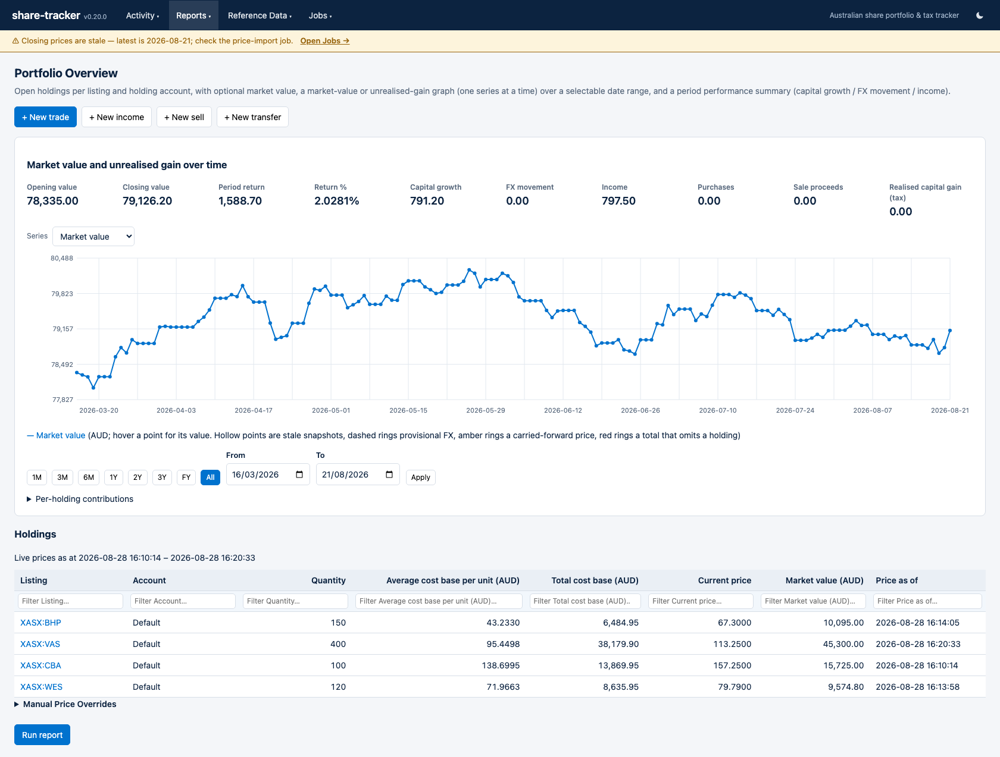
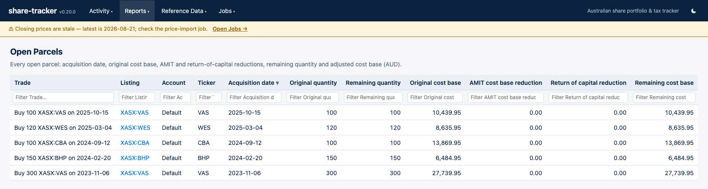
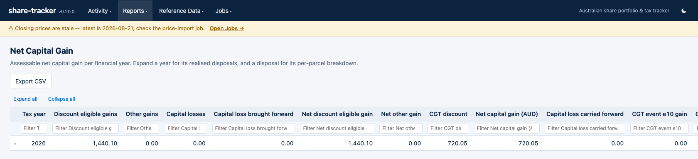
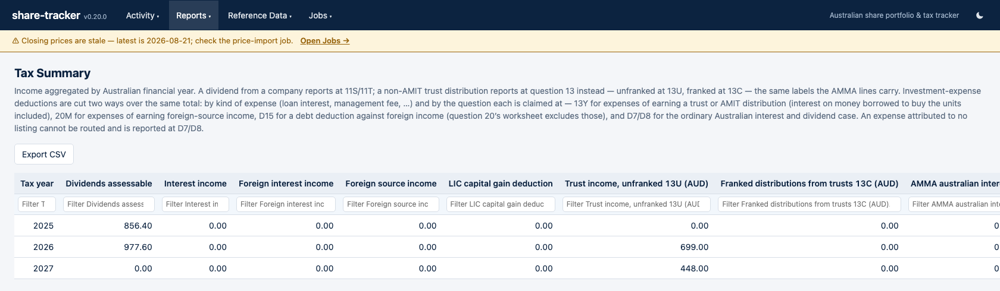

# share-tracker

A personal Australian share portfolio tracker with a REST JSON API and a built-in web UI. Record
trades, dividends and trust distributions; get portfolio and tax reports that follow Australian tax
rules — parcel-level CGT with the 50% discount, franking credits and the 45-day rule, AMIT/AMMA
cost-base adjustments, and a printable annual tax document.

Single user, single taxpayer, one SQLite file, no cloud service. Every figure is computed live from
the facts you entered and can be traced back to them.

<picture>
  <source media="(prefers-color-scheme: dark)" srcset="docs/screenshots/overview-dark.png">
  
</picture>

<sub>All screenshots show a fictional demo portfolio (`scripts/fixtures/showcase.json`), not real
holdings. They follow your GitHub theme — the app has its own light/dark toggle.</sub>

<details>
<summary><b>More screens</b> — open parcels, net capital gain, tax summary</summary>

**Open parcels** — every parcel still held, with its acquisition date, original cost base, AMIT and
return-of-capital reductions, remaining quantity and adjusted cost base.

<picture>
  <source media="(prefers-color-scheme: dark)" srcset="docs/screenshots/open-parcels-dark.png">
  
</picture>

**Net capital gain** — the CGT position per financial year: gains bucketed, losses applied in the
ATO-optimal order, the 50% discount, and the assessable figure.

<picture>
  <source media="(prefers-color-scheme: dark)" srcset="docs/screenshots/net-capital-gain-dark.png">
  
</picture>

**Tax summary** — income aggregated by Australian financial year, each line carrying the tax-return
label it belongs at.

<picture>
  <source media="(prefers-color-scheme: dark)" srcset="docs/screenshots/tax-summary-dark.png">
  
</picture>

</details>

## Features

The short version, in the order you'd meet them. **[docs/FEATURES.md](docs/FEATURES.md) has the
detail on every one** — what it computes, which ATO rule it follows, and where it stops.

- **[Recording what you hold](docs/FEATURES.md#recording-what-you-hold)** — buys, sells and DRP
  acquisitions with per-exchange settlement dates; dividends and distributions with the full
  Australian component breakdown; interest; entry forms shaped like the statement you're reading
  from, with the registry's own per-share figures cross-checked at write time. Multiple holding
  accounts, non-CGT transfers between them, and a supporting document attachable to any row.
- **[Capital gains and corporate actions](docs/FEATURES.md#capital-gains-and-corporate-actions)** —
  explicit parcel allocations on every sale, so cost bases are pro-rated per parcel. Return of
  capital (G1), splits and consolidations, bonus issues, rights issues, off-market buy-backs,
  scrip-for-scrip takeovers, demergers, and worthless-share write-offs (G3/C2) — each recorded as
  an action, then applied to the parcels it re-shapes.
- **[Managed funds](docs/FEATURES.md#managed-funds-amit--amma)** — AMIT/AMMA annual statements, with
  per-parcel cost-base adjustments generated from the parcels actually held at the tax year end
  (CGT event E10) rather than typed a row at a time.
- **[Other holdings and income](docs/FEATURES.md#other-holdings-and-income)** — employee share
  scheme statements and vesting, inherited parcels, deductible investment expenses, and crypto as a
  CGT asset.
- **[Reports](docs/FEATURES.md#reports)** — portfolio overview, per-listing activity ledger,
  unrealised and realised gains, investment performance (IRR and yield), net capital gain by
  financial year, tax summary, tax-return CSV export, and a printable annual tax document. Plus two
  decision-support reports: a parcel-selection optimiser and a pre-sale what-if.
- **[Prices and foreign exchange](docs/FEATURES.md#prices-and-foreign-exchange)** — daily closing
  prices collected per exchange close and stored as history, on-demand live valuation, daily report
  snapshots feeding the value graph, and monthly RBA rates for the AUD conversion every tax figure
  is made in.
- **[Cross-checks and alerts](docs/FEATURES.md#cross-checks-and-alerts)** — a dozen non-blocking
  reports that name what looks wrong without ever refusing a write: missing FX rates, unreconciled
  AMIT adjustments, rollovers that no longer add up, wash sales, franking credits about to fail the
  45-day rule, distributions that were never entered, and jobs that have stopped running.
- **[The application itself](docs/FEATURES.md#the-application-itself)** — a no-build-step web UI
  served from the same binary, an append-only audit trail of every edit and deletion, and optional
  single-credential authentication.

**Not in scope**, deliberately: this assumes a share **investor** on capital account (not a trader),
**one taxpayer per database**, and no pre-CGT holdings — among a dozen other decisions listed under
[Deliberate scope cuts](docs/FEATURES.md#deliberate-scope-cuts) and, endpoint by endpoint, in
[Known limitations](docs/API.md#known-limitations).

## Building and running

```bash
cargo build --release
./target/release/share-tracker [--config share-tracker.toml] [--db share-tracker.db] [--backup-dir /mnt/backups] [--backup-command 'scp {BACKUP_FILE} user@host:/backups/'] [--host 127.0.0.1] [--port 3000] [--base-path /share_tracker] [--schedule schedule.cron]
```

| Flag | Default | Description |
|------|---------|-------------|
| `--config` | `/usr/local/etc/share-tracker.toml` if it exists | Path to a TOML [configuration file](#configuration-file). An explicitly given path must exist |
| `--db` | `share-tracker.db` | SQLite database file path |
| `--backup-dir` | beside the database file | Directory the scheduled/triggered backups are written to (created if missing). Point it at another volume so a disk failure can't take the database and its backups together |
| `--backup-command` | none | Shell command to run after each fresh, verified backup — e.g. to copy it off-machine. `{BACKUP_FILE}` is replaced with the backup's absolute path |
| `--host` | `127.0.0.1` | IP address to bind. The default listens on localhost only; pass `0.0.0.0` to listen on all interfaces (reachable from other machines) |
| `--port` | `3000` | HTTP port to listen on |
| `--base-path` | none (mounted at `/`) | URL path prefix to mount the whole application under, for serving it from a sub-path [behind a reverse proxy](#behind-a-reverse-proxy) |
| `--schedule` | built-in `schedule.cron` | Path to a cron file overriding the built-in maintenance schedule |

`--version` prints the version (from `Cargo.toml`, the single source of truth for [release numbering](#releases-and-versioning)).

> **Note:** unless [`[auth]`](#authentication) is configured, the server has no authentication, so the default `--host 127.0.0.1` keeps it reachable from this machine only. Passing `--host 0.0.0.0` exposes it to every machine on the network — do that only on trusted networks, or with `[auth]` configured.

The database is created automatically on first run. Migrations are applied in order at startup.

### Tests

`cargo test` runs the Rust suite. The web frontend's pure JS helpers (the money-adjacent decimal-string arithmetic in `src/web/util.js`) have their own unit tests beside the modules (`src/web/*.test.js`), run with Node's built-in test runner — no build step and no `npm install`; **Node 22 or newer** is required:

```bash
node --test 'src/web/*.test.js'
```

`scripts/ui-smoke.sh` is a headless end-to-end smoke check: it starts the server on a temp database seeded from the demo fixture, renders key routes in headless Chrome, and asserts each view drew real data — catching a broken static-module route or a load-time JS exception that neither test suite can. CI runs all three on every push.

### Supply-chain checks

The server talks to the internet (Yahoo Finance, the RBA/ISO feeds), so its dependency tree is watched, not just its own code. CI fails on any known [RustSec](https://rustsec.org) advisory against the dependency tree via `cargo deny check advisories` (configured by [`deny.toml`](deny.toml)). The local equivalent:

```bash
cargo install cargo-deny --locked   # or: brew install cargo-deny
cargo deny check advisories
```

Dependency updates arrive without manual attention: [Dependabot](.github/dependabot.yml) raises a weekly grouped PR for Cargo dependencies (and one for GitHub Actions), and alert-driven security PRs fire as soon as an advisory lands.

**Policy for an advisory with no upstream fix yet** (decided 2026-07-14): the advisory goes on the temporary ignore list in `deny.toml` with the reason waiting is acceptable and an `# expires: YYYY-MM-DD` date. A test (`doc_checks::advisory_ignores_expire`) fails the suite once that date passes, so every ignore is re-justified or removed on a deadline — never permanent. An unmaintained dependency kept indefinitely is a replacement task in TODO.md, not an open-ended ignore.

### Configuration file

Every flag except `--config` can instead be set in a TOML configuration file, so a service manager doesn't need a pile of CLI flags. Precedence is **CLI flag > config-file value > built-in default**. The file is loaded from `/usr/local/etc/share-tracker.toml` when present (where the FreeBSD package installs it); `--config PATH` points somewhere else. Every key is optional:

```toml
db = "/var/db/share-tracker/share-tracker.db"
backup_dir = "/var/db/share-tracker/backups"
backup_command = "scp {BACKUP_FILE} user@host:/backups/"
host = "127.0.0.1"
port = 3000
base_path = "/share_tracker"   # only when proxied onto a sub-path; default is the root
schedule = "/usr/local/etc/share-tracker.cron"

# [auth]                       # see "Authentication" below; off by default
# username = "evan"
# password_hash = "$argon2id$v=19$m=19456,t=2,p=1$..."
```

An unknown key or invalid TOML aborts startup with the reason — a typo never silently falls back to a default (starting against the wrong database is worse than not starting). The full annotated example lives at [`pkg/freebsd/share-tracker.toml.sample`](pkg/freebsd/share-tracker.toml.sample).

### Authentication

Off by default (see the `--host` note above). To gate the whole application behind a single shared credential — access control only, not per-user data; the app stays single-taxpayer either way — add an `[auth]` table to the config file:

```toml
[auth]
username = "evan"
password_hash = "$argon2id$v=19$m=19456,t=2,p=1$..."   # share-tracker hash-password
api_token = "...optional, for scripts..."               # share-tracker gen-token
# secure_cookie = true   # default; set false only for a deliberately plain-HTTP setup
```

Generate both secrets with the binary's own helper subcommands rather than typing a password anywhere a shell history or `ps` could catch it:

```bash
share-tracker hash-password   # reads the password from stdin, prints an Argon2id PHC hash
share-tracker gen-token       # prints a random 64-hex-char bearer token
```

There is deliberately no `--auth-*` CLI flag for either value — config file only, for the same reason. Once `[auth]` is set, every route needs a session (sign in at `/login`; the session cookie lasts 30 days and survives a restart, but changing the password invalidates every existing session, since the session-signing key is derived from the password hash) or, for scripts that call the API without a browser, `Authorization: Bearer <api_token>` — the mechanism `pkg/freebsd/update.sh` and `smoke-test.sh` use once a token is configured. `POST /logout` clears the browser's cookie but cannot revoke a copied-out cookie value before its own expiry, there being no server-side session store to revoke it in (see [Known limitations](docs/API.md#known-limitations)). Full endpoint documentation: [Authentication](docs/API.md#authentication).

`[auth]` has no lockout counter of its own — failed logins are throttled only by Argon2's own ~30 ms/attempt cost, which is deliberate for a single-credential hobbyist deployment but scales with however many source IPs an attacker uses. If the server is reachable from the internet, rate-limit `/login` at the proxy rather than in the app — see the `limit_req` example in the next section.

### Behind a reverse proxy

The server binds `127.0.0.1`; unless [`[auth]`](#authentication) is configured it has **no authentication of its own**, so a reverse proxy is the natural place to put TLS and, in that case, access control too. Proxying it at the root of its own name (`https://tracker.example.com/`) needs no configuration here — just proxy to the port.

To serve it from a **sub-path** instead (`https://example.com/share_tracker/`), set `base_path`. The whole application moves under the prefix — every API route, the UI shell, and the static assets — and the UI emits its URLs with the prefix on them, so the proxy passes the path through **unchanged** rather than stripping it:

```
share-tracker --base-path /share_tracker
```

If [`[auth]`](#authentication) is configured and the server is reachable from the internet, also throttle `/login` — the app itself has no lockout counter (see the note above). Declare the zone once, in the `http {}` block:

```nginx
# 5 requests/minute per client IP, tracked in a 10 MB shared zone (enough
# for roughly 160,000 distinct IPs before the oldest entries are evicted).
limit_req_zone $binary_remote_addr zone=login:10m rate=5r/m;
```

Then add a `location` for it alongside the prefix one, inside the same `server {}`:

```nginx
location = /share_tracker/login {   # /login instead, without a base_path
    # burst=5 nodelay: a handful of quick attempts (e.g. a mistyped
    # password) still go straight through; sustained guessing gets
    # queued back down to the 5/minute rate. A request nginx throttles
    # gets nginx's own 503, before it ever reaches the app.
    limit_req zone=login burst=5 nodelay;
    proxy_pass http://127.0.0.1:3000;
    proxy_set_header Host              $host;
    proxy_set_header X-Real-IP         $remote_addr;
    proxy_set_header X-Forwarded-For   $proxy_add_x_forwarded_for;
    proxy_set_header X-Forwarded-Proto $scheme;
}

location /share_tracker/ {
    # No trailing slash on proxy_pass: that would strip the prefix, and the
    # app expects to receive it (it is what the app is mounted under).
    proxy_pass http://127.0.0.1:3000;

    proxy_set_header Host              $host;
    proxy_set_header X-Real-IP         $remote_addr;
    proxy_set_header X-Forwarded-For   $proxy_add_x_forwarded_for;
    proxy_set_header X-Forwarded-Proto $scheme;

    # Statement scans and other attachments are uploaded through the proxy;
    # the default 1M limit is low for a multi-page PDF.
    client_max_body_size 25m;
}
```

`location =` is an exact match, and nginx always prefers an exact match over a prefix match (like the `location /share_tracker/` block) regardless of the order the two appear in the file, so `/login` is rate-limited before it can fall through to the general proxying below it.

Because the app serves the prefixed paths itself, a prefixed deployment is reachable — and testable — without the proxy in front of it: `http://127.0.0.1:3000/share_tracker/` behaves exactly like the proxied URL. The startup log line names the base path for the same reason, so a mismatch between the proxy and the server is visible without reading either config:

```
share-tracker v0.10.2 started, db: …, listening on: http://127.0.0.1:3000/share_tracker/
```

`base_path` is normalised (a leading slash is added, a trailing one dropped), and an unusable value — one with a space, `?`, `#`, `%`, or an empty segment — aborts startup rather than yielding a server whose every request 404s. Leave it unset, empty, or `/` to mount at the root, which is the default.

The proxy must not rewrite the response body; no `sub_filter` is needed or wanted. Note that the app is a hash-routed SPA, so deep links (`#/r/overview`) never reach the proxy at all — the fragment stays in the browser.

### Scheduled maintenance

Recurring maintenance jobs — the database backup, the RBA FX rate import, the ISO MIC registry import, the currencies import, the closing-price collection, and the daily report snapshot — are scheduled from a cron file rather than hard-coded intervals. Each line is a 5-field Vixie cron expression (`min hour dom mon dow`), optionally followed by an IANA timezone (e.g. `America/New_York`), then the job name; `#` starts a comment. Without a timezone the expression is in local server time; with one, it fires on that zone's wall clock — the price imports use this so each run keeps a fixed margin over its market's close regardless of DST transitions at either end. The built-in default is embedded in the binary (`schedule.cron`); pass `--schedule <path>` to use your own file instead:

```
0 0 * * 0   backup          # weekly, Sunday 00:00
0 2 * * 1   rba-fx-import   # weekly, Monday 02:00
0 3 1 * *   mic-import      # monthly, 1st at 03:00 (ISO publishes monthly)
0 4 1 * *   currency-import # monthly, 1st at 04:00 (ISO 4217 + ISO 24165 / DTIF)
30 17 * * 1-5   Australia/Sydney   price-import  # after the 16:00 ASX close
30 17 * * 1-5   America/New_York   price-import  # after the 16:00 NYSE close
0  8  * * *     UTC                price-import  # crypto, ~8h after the UTC cut-off
0 9 * * *      UTC   report-snapshot # daily, once the day's last close has been imported
```

A schedule line naming an unknown job or an unknown timezone is rejected at startup. A job that *expects* a schedule but has no line is allowed and logged as a `WARN` at startup (it will then only run via its endpoint) — and that warning now means one thing only, that a line has been lost.

#### Manual-only jobs

A job that is **deliberately** schedule-less says so in the job registry itself (it is added with `register_manual` rather than `register`, in `src/infra/scheduler/registry.rs`), so it never warns, and `GET /jobs` carries the same intent as `"trigger": "manual_only"` — the Jobs screen labels it **manual only**, so a status of `never` there reads as expected rather than as a missed run. `price-rebase` is one of the two manual-only jobs: a one-off repair that re-derives every stored closing price from the figure it was observed as, for a database whose prices predate the contemporaneous-basis rule (see [Closing prices](docs/API.md#closing-prices)) — idempotent, and a no-op unless a share split, a bonus issue, or a demerger carrying a stated pre-demerger close is recorded. So is `settlement-recompute`: run it after seeding a missing [exchange holiday](docs/API.md#exchange-holidays) year, and it re-derives every auto-calculated settlement date from the completed calendar (a `settlement_date` you entered yourself is never touched) — likewise idempotent, and a no-op on a database whose calendars were complete when its trades were written.

#### Knowing a job is still scheduled

Jobs run only at their scheduled times (not at startup); after each run (and at startup) the next scheduled run is logged at INFO, in the entry's timezone — **and stored**, in `job_schedule`, one row per schedule entry. That stored instant is what makes a job that has *stopped running* visible at all: a job that is not running records nothing, so its last successful run stayed in place and the Jobs screen kept reading `ok` indefinitely, however long ago the scheduler had died (SCENARIOS T-11/T-02/T-12). A cron pattern with no future occurrence — `0 0 30 2 *`, 30 February — is accepted at startup: the entry logs one `ERROR cannot compute next run, stopping` and its task exits, and nothing else ever noticed. Now the [health report](docs/API.md#health) lists a stored instant more than **6 hours** past as `overdue_jobs`, the cross-view banner names the job and how late it is, and the Jobs screen carries a **next run** column, so the one surface an operator checks can answer "is this still scheduled, and when is it due?". The table describes the schedule *this* process is running — it is cleared at startup and rebuilt by the entry tasks — so a job whose line has been removed simply has no row: that case is the startup `WARN` above, not a permanent alarm. Manual-only jobs have no row and are never reported overdue. A run left `running` for more than 6 hours is reported alongside as `stalled_jobs`: nothing will finish it, because the process that would have is gone. In a zone's DST gap (a job scheduled inside the skipped hour) the job fires at the first valid instant after the gap; in a DST fold (the repeated hour) it fires once, at the first occurrence. Timer sleeps are capped at an hour and the target recomputed after each, so a clock shift mid-wait (DST, NTP, suspend) re-anchors the fire time to the schedule's wall-clock target.

#### The backup job

The backup writes `<stem>-YYYY-MM-DD-HHMMSS.db` beside the main database file, or into `--backup-dir` when set (the date-time component keeps each weekly run distinct; skipped only if a file with that exact name already exists). The copy is written to a **staging name** first — `<stem>-YYYY-MM-DD-HHMMSS.db.partial` — and moved onto the backup name only once it has verified, so write, verify, rename is the order and a file carrying a backup's name has always passed verification. That matters because nothing waits for a running job on shutdown (and nothing could, for a `SIGKILL` or a power cut): a `service share-tracker restart`, a reboot, or a `pkg` upgrade landing on Sunday 00:00 — the weekly backup's own slot — kills the copy mid-write, and what it leaves behind is a `.partial` file, which is not counted by retention pruning, can never become a monthly keeper, and is never a restore candidate. Startup sweeps leftover `.partial` files of this database (logged at INFO); nothing else in the directory is touched by that sweep. Each fresh backup is **verified** before the job reports success: the produced file is opened and must pass `PRAGMA integrity_check`, and its applied migrations must match the live database's. A file that fails verification is quarantined by renaming it to `<name>.db.bad` — never left looking like a good backup — and the run fails loudly: the reason is logged at ERROR and recorded as the run's error (`GET /jobs`). Once a fresh backup is verified, the configured `--backup-command` (if any) runs once against it — unless the run was triggered with `?skip_command=true` — see [Off-machine copies](#off-machine-copies).

#### Backup retention

After a verified backup the destination is **pruned** to a bounded set: the **newest 8 backups** are kept, plus the **first backup of each calendar month for the 12 most recent months** that have one (with the weekly schedule, roughly two months of every backup plus a year of monthlies). Pruning deletes only files matching the backup filename pattern for this database (`<stem>-YYYY-MM-DD-HHMMSS[-suffix].db`) in the backup destination — the live database, its WAL sidecars, staging `.partial` files, and anything else are never touched. Quarantined `.bad` files are the one exception to "kept forever": they are kept for diagnosis but bounded to the **newest 3**, because the likely cause of a verification failure is a failing disk, which fails every weekly run — an unbounded set would fill the volume with full-size copies, which is the very failure the backups exist to survive.

#### Running a job by hand

Any job can be run on demand with `POST /jobs/{name}` (see the [HTTP API](docs/API.md#jobs)); the backup job additionally takes an optional `?skip_command=true` to leave the configured post-backup command unrun for that one run (see [Off-machine copies](#off-machine-copies)) and an optional `?suffix=` to label a one-off run (e.g. `pkg/freebsd/update.sh`'s `pre-<version>` backup right before installing a new package — see [Upgrading](#installing-on-freebsd) below) — a suffixed backup competes in the same retention policy as any other, never exempt from pruning.

#### Digital token reference data (ISO 24165)

The `currency-import` job imports two feeds into one recognised-currencies list: the ISO 4217 fiat list, published free by SIX Group (the ISO 4217 Maintenance Agency), and the ISO 24165 Digital Token Identifier registry, published by the DTI Foundation. **The DTIF download is credential-gated**: set `DTI_REGISTRY_USER_ID` and `DTI_REGISTRY_PASSWORD` in the server's environment (register for them at [dtif.org](https://dtif.org/)) and the job imports both halves. Without them it imports the fiat half and **skips** the token half — which is a supported configuration, not a failure: the job still succeeds, and the seeded token list (BTC and ETH) is enough to record crypto holdings in those two.

What the skip is *not* is silent. The run says which feed it passed over and why, in three places: the job's INFO completion line, the `POST /currencies/import` response (`{ "fiat": 178, "tokens": null, "skipped": "ISO 24165 digital token feed skipped: …" }` — a feed that was not attempted is `null`, never `0`), and the run's own **Note** on the Jobs screen, beside a status that stays `ok`. Before that the run reported one combined `imported` count, so a half-import read exactly like a complete one and a green Jobs screen was not the evidence it looked like (SCENARIOS T-09). Recording a crypto holding whose token is not in the list is refused at write time with a message naming these credentials as the remedy, so the gap is also caught at the point of use.

A DTIF snapshot can be loaded **without** giving the server credentials at all: download `data.json` yourself and `POST` it as the body of `/currencies/import` (see the [HTTP API](docs/API.md#currencies)). That imports the one feed you supplied, and reports it as such.

### Restoring from a backup

Each backup file is a complete, standalone SQLite database (written with `VACUUM INTO`). To restore one:

1. **Stop the server** — the database file must not be in use.
2. **Replace the database file with the backup**, e.g. `cp share-tracker-2026-06-07-000000.db share-tracker.db` (keep a copy of the backup — restore from a copy, not your only one).
3. **Delete the stale WAL sidecars** if present: `rm -f share-tracker.db-wal share-tracker.db-shm`. They belong to the replaced database; leaving them would let SQLite replay post-backup changes over the restored file.
4. **Restart the server.** Pending migrations (if the backup predates an upgrade) are applied at startup as usual.

Everything recorded after the backup was taken is gone after a restore — re-enter it manually. The restore round-trip (backup → mutate → restore → pre-mutation state) is proven by `restore_round_trip_recovers_pre_mutation_state` in `src/infra/db.rs`, and the full job-path drill (verified backup → restore → every table's row count matches the source) by `restore_drill_backup_restores_with_matching_row_counts` beside it.

### Off-machine copies

`--backup-dir` can put backups on a different volume, but a machine-level failure (dead disk controller, theft, fire) still takes the database and every backup together. The server never embeds remote credentials or provider-specific upload logic itself — it only ever shells out to a command *you* configure, so the choice of destination and how to authenticate to it stays entirely in your own config, not in a local tax tool's code.

**`--backup-command`** runs once, right after each fresh backup is written and verified, with `{BACKUP_FILE}` replaced by that backup's absolute path — e.g.:

```
--backup-command 'scp {BACKUP_FILE} user@host:/backups/'
--backup-command 'rclone copy {BACKUP_FILE} remote:share-tracker-backups/'
```

It runs via `sh -c`, so ordinary shell syntax (multiple commands, pipes, redirection) works. This is the recommended way to get an off-machine copy: because it fires exactly once per completed, verified backup, the offsite copy can never race a slow backup or silently miss a run the way a fixed-offset cron job can. A failing command fails the backup job loudly (logged at ERROR, recorded as the run's error in `GET /jobs`) but never blocks the backup itself or its local pruning.

A single manual run can suppress the command with `POST /jobs/backup?skip_command=true` (see [Jobs](docs/API.md#jobs)): the backup is still taken and verified, only the off-machine copy is passed over, and the run reports success carrying a note saying so. It is per-run — the configuration is untouched, so the next scheduled backup copies off-machine as configured. That is what the pre-upgrade backup uses (`pkg/freebsd/update.sh`, [Upgrading](#installing-on-freebsd)): a rollback point taken seconds before `pkg add` shouldn't hold the upgrade open for as long as it takes to ship a full copy of the database over the network, for a file the weekly run sends anyway.

Alternatively, an **independent cron job** pointed at the backup directory works too, and is simpler to reason about if you'd rather mirror a whole directory than trigger per-run:

```
# crontab: mirror the backup directory to cloud storage, Sundays at 00:30
30 0 * * 0  rclone sync /mnt/backups remote:share-tracker-backups
```

`rclone sync` (or `rsync --delete` to another machine) mirrors deletions, so the offsite copy inherits the local retention policy; use `rclone copy` instead if the remote should keep every backup ever uploaded. Either way, verify the offsite copy occasionally by downloading one file and following [Restoring from a backup](#restoring-from-a-backup) against a scratch `--db` path.

Logging is controlled by the `RUST_LOG` environment variable (default: `info`).

## Installing on FreeBSD

Each release ships a FreeBSD package (built on FreeBSD 15.1 amd64 — the pkg ABI must match the installing host's major version). Download the `.pkg` from the [releases page](https://github.com/evanclarke/share-tracker/releases) and:

```sh
pkg add ./share-tracker-<version>.pkg
sysrc share_tracker_enable=YES
service share_tracker start
```

Installing creates a non-login `share_tracker` service user and `/var/db/share-tracker` (database + backups) owned by it, and places the configuration at `/usr/local/etc/share-tracker.toml` and the maintenance schedule at `/usr/local/etc/share-tracker.cron` (both activated from shipped `.sample` files: first install copies them into place, upgrades and deinstalls preserve your edits — the same semantics as the ports `@sample` keyword, implemented in the manifest's own scripts). The service runs under [daemon(8)](https://man.freebsd.org/cgi/man.cgi?daemon(8)) — restarted if it crashes, logging to `/var/log/share-tracker.log`, which [newsyslog(8)](https://man.freebsd.org/cgi/man.cgi?newsyslog(8)) rotates via the shipped `/usr/local/etc/newsyslog.conf.d/share-tracker.conf` (weekly or past ~1 MB, 8 compressed rotations kept; the rotation SIGHUP makes daemon(8) reopen the file without restarting the server). `share_tracker_config`, `share_tracker_user`, and `share_tracker_logfile` can be overridden in `rc.conf` (keep the newsyslog config in sync if you move the log). Deinstalling the package never removes the database, backups, or edited config — financial records survive `pkg delete`.

The package skeleton lives in [`pkg/freebsd/`](pkg/freebsd/); `pkg/freebsd/build-pkg.sh` builds the same package locally on any FreeBSD host.

To upgrade an existing install, run `pkg/freebsd/update.sh` as root (e.g. `doas pkg/freebsd/update.sh`) on the deployment host: it checks the GitHub releases API for the latest version (or installs a specific one, e.g. `update.sh 0.5.0`), downloads the matching `.pkg`, installs it with `pkg add -f`, and restarts the service if it was already running. There is deliberately no cron job for this — upgrading is a manual, deliberate step, not an automatic one.

Before installing, if the service is running, `update.sh` takes a one-off backup suffixed `pre-<version>` (`POST /jobs/backup?suffix=pre-<version>`, over `curl` — a package dependency for exactly this — reading the target `host`/`port` from the active config) and **aborts before touching the package** if that backup fails, so an upgrade never proceeds without a fresh rollback point on top of the weekly scheduled one. If the service isn't running (e.g. before the first `service share_tracker start`) there is nothing to back up yet, so the step is skipped with a warning; pass `-n`/`--no-backup` to skip it deliberately. Restore a pre-upgrade backup the same way as any other — see [Restoring from a backup](#restoring-from-a-backup).

## Releases and versioning

`Cargo.toml`'s `version` is the single source of truth: the binary's `--version`, the pkg version, and the release tag all derive from it. On every push to `main`, the [release workflow](.github/workflows/release.yml) checks whether a release exists for the current version; if not, it builds the package natively in a FreeBSD 15.1 VM, installs and smoke-tests it inside the VM (`pkg/freebsd/smoke-test.sh`: version check, rc-script load, server answers HTTP), then publishes release `v<version>` with the `.pkg` attached — tagging the exact commit the package was built from. The release notes are generated from the commit subjects between the previous release tag and that commit ([`scripts/release-notes.sh`](scripts/release-notes.sh)), with a full-changelog compare link; the first release lists every commit. **Cutting a release = bumping `version` in `Cargo.toml`** (and `cargo build` once so `Cargo.lock` follows) and pushing to `main`; a push without a version bump publishes nothing.

## Documentation

- [Features](docs/FEATURES.md) — what each feature does, the ATO rule behind it, and where it stops
- [Database schema](docs/SCHEMA.md) — every table, column, and relationship
- [HTTP API](docs/API.md) — every endpoint, request/response shape, and response code, plus known limitations
- [docs/ato/](docs/ato/OVERVIEW.md) — mirrored ATO reference guidance behind the tax calculations

## Tech stack

- **Rust** (edition 2024)
- **axum 0.8** — HTTP framework
- **sqlx 0.8** — async SQLite driver with compile-time migration support
- **SQLite** with WAL journal mode and foreign key enforcement
- **rust_decimal** — arbitrary-precision decimal arithmetic for all monetary values
- **tokio** — async runtime
- **reqwest** — HTTP client for fetching the RBA F11 FX rate CSV
- **yfinance-rs** — Yahoo Finance client behind the closing-price fetcher (note: its build script needs `protoc` — `brew install protobuf` / `apt install protobuf-compiler`)
- **chrono / chrono-tz** — date handling
